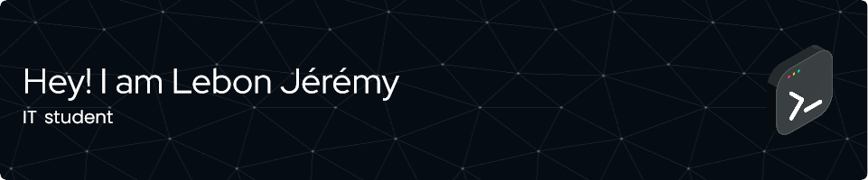

<h1 align="center">
# 👨‍💻 Jérémy LEBON

## Administrateur Systèmes & Réseaux | Étudiant en Cybersécurité

🎯 Passionné par les technologies systèmes et réseaux, je suis actuellement en Bachelor IT Cybersécurité. Après plusieurs années dans l'industrie, je me reconvertis avec enthousiasme dans l'administration réseau sur Linux et Windows, avec pour objectif d’atteindre un niveau professionnel et certifiable.

---

## 💼 Compétences Techniques

- **Systèmes** : Windows Server, Linux (Debian, Ubuntu)
- **Réseaux** : TCP/IP, DNS, DHCP, VLAN, VPN, Routage, Firewall
- **Services** : FTP, SSH, Proxy, NFS, CIFS, Samba
- **Virtualisation** : VMware, Hyper-V, VirtualBox
- **Scripts** : Bash, PowerShell
- **Annuaire** : Active Directory, LDAP
- **Outils** : TrueNAS, Asterisk, Cisco Packet Tracer, WireShark

---

## 🛠️ Projets réalisés

- 🔐 Mise en place d’un serveur **TrueNAS** sécurisé (SFTP, WebDAV, RAID)
- 📞 Déploiement d’un serveur VoIP avec **Asterisk**
- 🧾 Administration d’un annuaire **LDAP**
- 🧑‍💻 Configuration complète d’une infrastructure réseau sous **Debian** (DHCP, DNS, FTP, SSH)
- 🧪 Simulations réseau avec **Cisco Packet Tracer**
- 🖥️ Création et gestion d’un **Active Directory** sous Windows Server 2025

---

## 🎓 Formation

- **2024 – En cours** : Bachelor IT Cybersécurité – La Plateforme
- **2012** : Bac Pro Technicien Chaudronnerie Industrielle – Lycée Jean Dupuy
- **2009** : CAP Construction Ensembles Chaudronnés – Lycée Philippe Tissié

---

## 🧑‍🏭 Parcours Professionnel

- **2017 – 2022** : Opérateur Polyvalent – Aubert & Duval
- **2013 – 2017** : Technicien en maintenance & intérim – Aubert & Duval / Recaero
- **2011 – 2013** : Débiteur – Aubert & Duval

---

## 🧩 Autres informations

- **Langues** : Français (natif), Anglais (intermédiaire)
- **Permis** : B
- **Centres d’intérêt** : Jeux vidéo, Randonnée, Puzzle
- **Qualités** : Travail en équipe, Sens des responsabilités, Résolution de problèmes, Esprit de synthèse

---

## 📫 Me contacter

📧 lebonjeremy09@gmail.com  
📍 France

---

Merci de visiter mon profil GitHub ! N'hésitez pas à explorer mes dépôts pour découvrir mes projets techniques liés aux systèmes, aux réseaux et à la cybersécurité.

